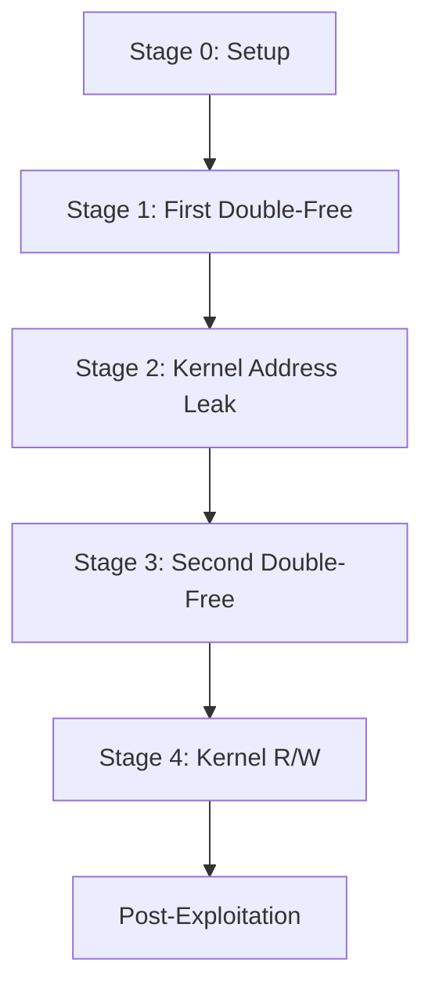
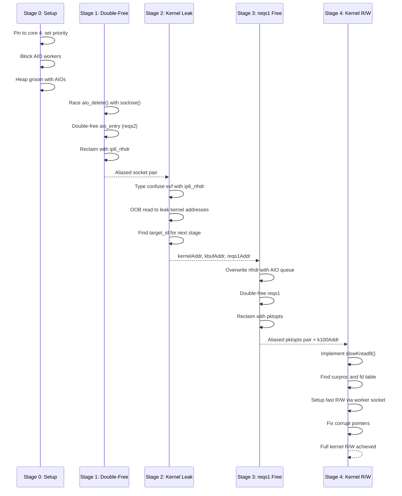

# Technical Overview

BD-JB is a sophisticated kernel exploitation chain for PlayStation 4 that achieves arbitrary kernel read/write capabilities through a series of carefully orchestrated memory corruption techniques. This exploit leverages the BD-J (Blu-ray Disc Java) environment as an attack vector.

## Exploit Chain Architecture

The exploit consists of four main stages that build upon each other:



### Stage Overview

1. **[Stage 0: Setup](/technical/stage-0-setup)** - Environment preparation with CPU pinning, AIO worker blocking, and heap grooming
2. **[Stage 1: Double-Free on reqs2](/technical/stage-1-double-free)** - First memory corruption using AIO race conditions
3. **[Stage 2: Kernel Leak](/technical/stage-2-kernel-leak)** - Type confusion to leak kernel addresses
4. **[Stage 3: reqs1 Double-Free](/technical/stage-3-reqs1-double-free)** - Second memory corruption for controlled write primitive
5. **[Stage 4: Kernel R/W](/technical/stage-4-kernel-rw)** - Achieving arbitrary kernel read/write

## Memory Corruption Approach

The exploit uses **Asynchronous I/O (AIO) race conditions** as its primary memory corruption primitive:

- **Race Window**: Exploits timing between `aio_delete()` calls and socket closure operations
- **Double-Free**: Achieves use-after-free conditions by winning race conditions
- **Heap Spray**: Uses socket options (routing headers, packet options) to reclaim freed memory
- **Type Confusion**: Overlaps different kernel structures to leak pointers and gain control

<Note>
The exploit requires precise timing control, which is achieved through CPU pinning (core 4) and real-time priority scheduling (0x100).
</Note>

## Why BD-J as Attack Vector?

BD-J provides several advantages for exploitation:

1. **Java Runtime**: Provides memory management and threading capabilities
2. **Native Interface**: Access to low-level syscalls through JNI
3. **Persistence**: Can run during disc playback without user interaction
4. **Sandboxed Environment**: Limited security scrutiny compared to main system

<Warning>
BD-J applications run in a restricted environment, but the exploit breaks out through kernel vulnerabilities.
</Warning>

## Kernel Offsets and Firmware Compatibility

The exploit requires firmware-specific kernel offsets defined in `KernelOffset.java`. Key offsets include:

```java
// Process structure offsets
PROC_PID         // Process ID location
PROC_FD          // File descriptor table pointer
FILEDESC_OFILES  // Open files array

// Socket structure offsets
SO_PCB           // Protocol control block
INPCB_PKTOPTS    // IPv6 packet options
PS4_OFF_TCLASS   // Traffic class field
PS4_OFF_RTHDR    // Routing header pointer
PS4_OFF_IP6PO_RTHDR // Packet options routing header
```

### Supported Firmware Versions

The exploit has been tested on:

- **9.00** - Primary target
- **9.60** - Tested and working
- **10.00** - Tested and working
- **10.50** - Tested and working
- **11.00** - Tested and working

<Note>
Each firmware version requires specific kernel offsets. The exploit checks compatibility before execution via `KernelOffset.hasPS4Offsets()`.
</Note>

## Exploit Flow Diagram



## Technical Constants

From `Lapse.java:34-45`:

```java
public static final int MAIN_CORE = 4;           // CPU core for main thread
public static final int MAIN_RTPRIO = 0x100;     // Real-time priority
public static final int NUM_WORKERS = 2;          // AIO worker threads
public static final int NUM_GROOMS = 0x200;       // Heap grooming AIOs (512)
public static final int NUM_SDS = 64;             // Socket descriptors for stage 1-2
public static final int NUM_SDS_ALT = 48;         // Socket descriptors for stage 3-4
public static final int NUM_RACES = 100;          // Maximum race attempts
public static final int NUM_ALIAS = 100;          // Maximum alias attempts
public static final int NUM_HANDLES = 0x100;      // EVF handles for reclaim (256)
public static final int LEAK_LEN = 16;            // Out-of-bounds read multiplier
public static final int NUM_LEAKS = 16;           // Leak attempts
public static final int NUM_CLOBBERS = 8;         // Memory clobber attempts
```

## Memory Zones

The exploit targets specific FreeBSD kernel memory zones:

- **0x80 zone** - Used for `aio_entry` structures and `ip6_rthdr` objects
- **0x100 zone** - Used for `SceKernelAioRWRequest` and IPv6 packet options

<Warning>
Memory zone targeting is critical. Incorrect zone usage will cause kernel panics.
</Warning>

## Success Criteria

Each stage has specific success conditions:

1. **Stage 1**: Both delete operations return error 0 + socket aliasing detected
2. **Stage 2**: Valid kernel addresses leaked (high word = 0xffff) + target_id found
3. **Stage 3**: Delete errors match + aliased pktopts created
4. **Stage 4**: slowKread8 reads "evf cv" string correctly + curproc verification via PID

## Next Steps

For detailed technical implementation of each stage:

- [Stage 0: Setup](/technical/stage-0-setup) - CPU pinning, worker blocking, heap grooming
- [Stage 1: Double-Free](/technical/stage-1-double-free) - First memory corruption
- [Stage 2: Kernel Leak](/technical/stage-2-kernel-leak) - Address leaking via type confusion
- [Stage 3: reqs1 Double-Free](/technical/stage-3-reqs1-double-free) - Second corruption
- [Stage 4: Kernel R/W](/technical/stage-4-kernel-rw) - Arbitrary read/write primitive

## References

- Source: `Lapse.java` - Main exploit implementation
- Credits: Based on PSFree by theflow0 and subsequent ports
- License: GNU AGPL v3
